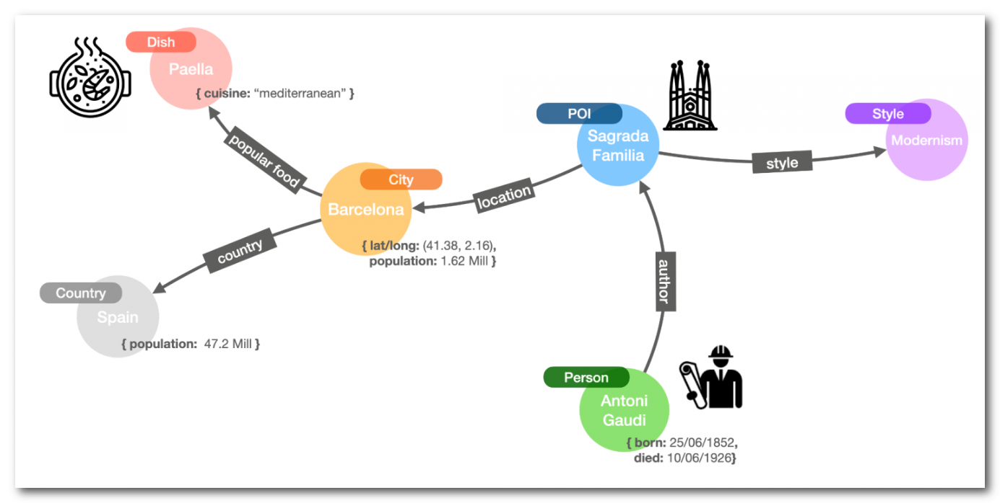
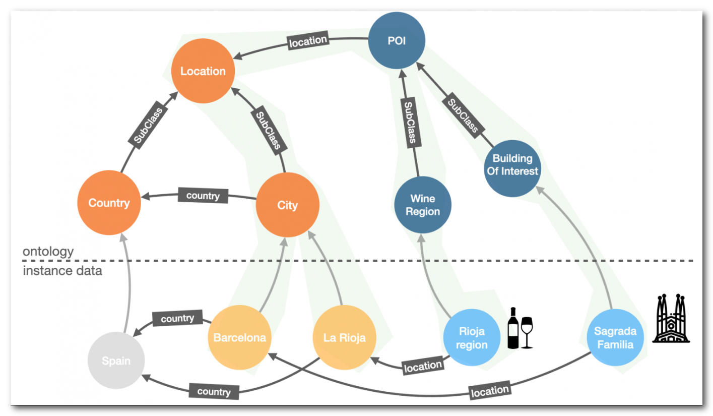
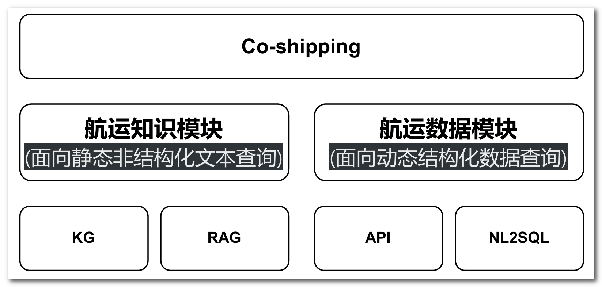
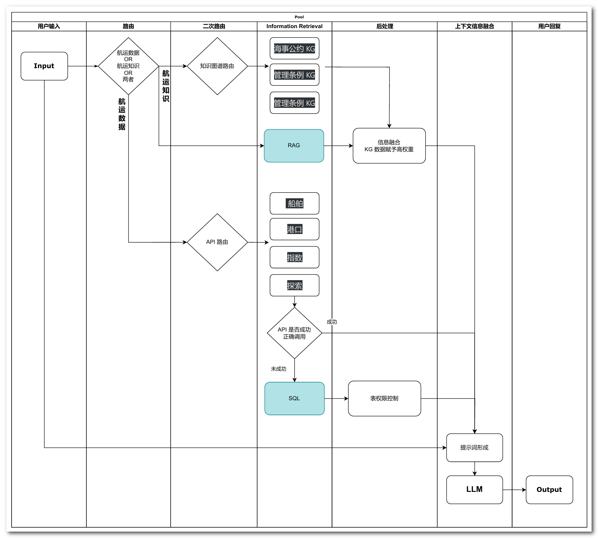
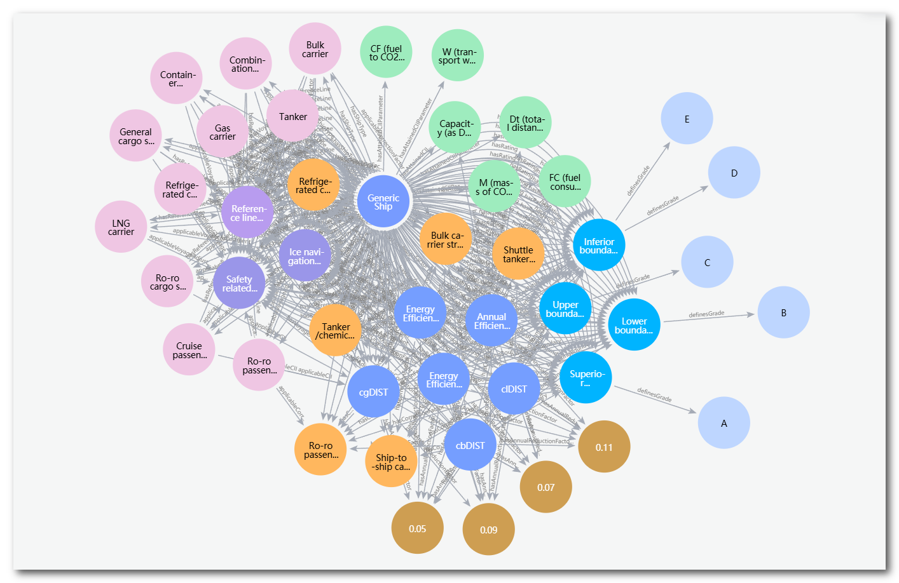
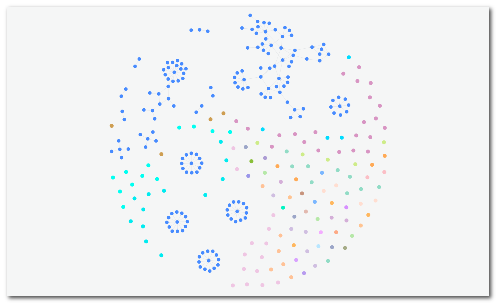

# Knowledge Graph 

## 1 Knowledge Graph 简介

### 1.1 什么是知识图谱 ? 

> [What Is a Knowledge Graph? - Neo4j Graph Database & Analytics](https://neo4j.com/blog/what-is-knowledge-graph/)

知识图谱是一种用于 **表示结构化知识的形式化方法**, 它将知识抽象为实体(entity)和关系(relation), 通过节点和边的形式表达出来, 以图的形式呈现。

任何人、物、地点或事件都可以是节点。关系描述了节点之间的任何互动；例如，事件发生在某个地点，某个人认识另一个人，等等。节点和关系将标注其类型，并通过一系列属性来描述它们的特征。例如，代表一个城市的节点通常会有一个属性来表示其当前的人口或地理位置，而一个人则会有一个出生日期和一个名字，等等。

> 在航运业场景下, 我们可以进行下面航运业角色进行下面的抽象 : 
>
> **节点 (Nodes):**
>
> * **船公司 (Shipping Company):** 例如，马士基 (Maersk), 中远海运 (COSCO)
>     * **属性:** 公司名称, 总部地址, 成立时间, 船队规模...
> * **船舶 (Vessel):**  例如, 玛丽皇后2号 (Queen Mary 2), MSC Zoe
>     * **属性:** 船名, IMO 编号, 船型, 建造年份, 船东, 当前位置...
> * **港口 (Port):** 例如，上海港, 新加坡港, 鹿特丹港
>     * **属性:** 港口名称, 所属国家,  地理位置,  吞吐量...
> * **政策 (Policy):** 例如，国际海上人命安全公约 (SOLAS), 压载水管理公约
>     * **属性:** 政策名称, 生效日期,  发布机构...
> * **IMO (国际海事组织):** 
>     * **属性:** 成立时间, 宗旨, 主要职责...
> * **CII (现有船舶能效指数):**
>     * **属性:** 计算方法,  评级标准,  实施时间...
>
> **关系 (Relationships):**
>
> * **拥有 (Owns):**  船公司 **拥有** 船舶。例如，马士基 **拥有** 玛丽皇后2号。
> * **停靠 (Calls at):** 船舶 **停靠** 港口。例如，MSC Zoe **停靠** 上海港。
> * **发布 (Issues):** IMO **发布** 政策。例如，IMO **发布** 压载水管理公约。
> * **遵守 (Complies with):** 船舶 **遵守** 政策。例如，玛丽皇后2号 **遵守** 国际海上人命安全公约。
> * **影响 (Affects):**  政策 **影响** 船公司。例如，压载水管理公约 **影响** 中远海运。
> * **衡量 (Measures):** CII **衡量** 船舶的能效。
>
> **属性 (Attributes):**
>
> * **公司名称:** 马士基
> * **船名:** 玛丽皇后2号
> * **IMO 编号:** 9232342
> * **港口名称:** 上海港
> * **政策名称:** 压载水管理公约
>
> 通过 这个知识图谱, 我们可以完成以下任务 : **风险评估:**  分析船舶、港口和政策之间的关系，评估航运风险。或是 **政策解读:**  帮助理解政策对不同船公司和船舶的影响。

> [Later] 构建航运知识图谱 Demo

### 1.2 知识图谱的语义框架 - 本体 (Ontology)

本体 形式化建模和定义了 知识图谱中的**实体类型和关系类型**. 规定了它们的**属性、层次结构**等信息。类比面向对象的语言, 本体相当于类, 而实体相当于实例. 关系则相当于类之间的方法或关联，定义了实例之间的交互和连接方式。

这种方法一般来讲基于语义层次进行建模, 它们可以被视为知识图谱中信息的业务导向描述模式.  但最有趣的是，它们也被描述为图谱，存储在同一个知识图谱中, 与数据共存. 所以本体不仅具有描述性，还具有可操作性。由于本体是作为节点和关系存储在图中的，因此可以编写从数据平面到本体再返回的逻辑（查询/模式），从而提供更丰富的答案. 

> [Later] 基于航运知识图谱, 展示 本体 实体关系, 展示长程推理能力

### 1.3 知识图谱的核心概念

| 核心概念       | 解释                                                         |
| -------------- | :----------------------------------------------------------- |
| 实体(Entity)   | 知识图谱中表示某个具体事物的节点, 如人物、地点、组织机构、事件等。每个实体都有一个唯一的标识符。 |
| 关系(Relation) | 实体与实体之间的语义联系, 用来描述两个实体之间的关系类型, 如 "出生地"、"母亲"、"首都" 等。 |
| 三元组(Triple) | 知识图谱中的基本数据结构单元, 由"主语-谓语-宾语"组成, 例如"北京-首都-中国"。 |
| 本体(Ontology) | 对知识图谱中的实体类型和关系类型的形式化建模和定义,规定了它们的属性、层次结构等信息 |

### 1.4 知识图谱的优势与缺陷 | 以 RAG 的场景为例 

在 RAG（Retrieval-Augmented Generation）场景下，知识图谱可以在**信息搜索的精度**和**信息搜索的广度**两个方面显著提升 RAG 的表现。

**首先**，关于**信息搜索的精度**，在保证知识图谱质量的前提下，节点及其关系存储了大量准确且有价值的信息。这些节点和关系都是**可直接搜索的属性**（Searchable properties），因此我们可以直接定位到所需的信息，获取最专业、最清晰的答案。这相比于传统的 RAG 方法，具有明显的优势。

传统的 RAG 方法在信息召回方面通常采用**混合多路召回**策略，包括**基于向量相似度**的文档召回和**基于关键字匹配**的文档召回。基于向量相似度的方法优势在于能够匹配模糊的语义，但在处理一些精确的专业概念时，可能会导致匹配结果的模糊性。为了解决这一问题，通常会结合基于关键字匹配的方法进行查询。然而，当面对一个非常广泛的文档数据库时，相同的关键字可能会出现在不同质量的文档段落中，导致提取到的信息复杂且难以甄别。

相比之下，使用知识图谱，我们能够保证其专业性和准确性。当我们需要搜索的信息匹配上某个特定节点或关系时，可以直接定位并获取相关信息，从而显著提升信息搜索的精度。这种直接定位和精准获取的能力，使知识图谱在信息搜索中展现出明显的优势。

**其次**，关于**信息搜索的广度**，无论是采用多么高效准确的召回方法, 传统的 RAG 方法只能找到与查询直接相关的信息，无法进一步扩展思考。然而，知识图谱通过编码实体之间的关系，使得一个实体可以通过某种关系连接到另一个实体，进而再通过另一种关系连接到更多的实体。这样，我们就能够获得更全面的信息。这也就是 知识图谱的多跳搜索( **Multihop Searches** ) . 

举个航运场景的例子，假设我们需要查询某个港口的货物吞吐量。在传统的 RAG 方法中，我们可能只能得到关于该港口货物吞吐量的直接数据。然而，使用知识图谱，我们不仅可以获得该港口的货物吞吐量信息，还可以进一步了解到与该港口有业务往来的各个航运公司、这些航运公司的船舶信息、船舶的航行路线、以及沿途各个港口的货物处理能力等信息。

| 提升方面       | 传统 RAG 方法                                                | 知识图谱                                                     |
| :------------- | :----------------------------------------------------------- | :----------------------------------------------------------- |
| 信息搜索的精度 | 混合多路召回策略，包括基于向量相似度和关键字匹配的方法。这些方法在处理精确的专业概念时可能会有模糊性。 | 节点及其关系存储了大量准确且有价值的信息，直接定位到所需的信息，获取最专业、最清晰的答案，显著提升信息搜索的精度。 |
| 信息搜索的广度 | 只能找到与查询直接相关的信息，无法进一步扩展思考。           | 通过编码实体之间的关系，使得一个实体可以通过某种关系连接到另一个实体，进而再通过另一种关系连接到更多的实体，获得更全面的信息，实现多跳搜索（Multihop Searches）。 |

**知识图谱的局限性**

| 局限性 | 解释                                                         | 解决方案                                                     | 样例 1                                                       | 样例 2                                                       |
| :----: | ------------------------------------------------------------ | ------------------------------------------------------------ | ------------------------------------------------------------ | ------------------------------------------------------------ |
|   ①    | 知识图谱难以有效表达 **时序数据** 和 **动态变化** 的知识。   | 可以使用 **时序数据库** 或其他专门的数据库来处理和存储时序和动态数据。 | 例如，表示某只股票的价格变化过程： 知识图谱难以直接表示“2024年6月1日，苹果公司的股票价格是150美元；2024年6月2日，价格变为152美元”。可以使用时序数据库来存储这样的数据。 | 例如，表示某艘船的航行位置变化过程： 知识图谱难以直接表示 “2024年6月1日，船只A在坐标(30.0, -40.0)；2024年6月2日，船只A在坐标(32.1, -42.3)”。可以使用时序数据库来存储这些动态位置数据。 |
|   ②    | 对于 **复杂的因果关系** 和 **逻辑推理**，难以简单化为三元组关系。 | 可以提取相关信息，结合 **LLM**（大语言模型）提供常识和逻辑推理能力。 | 例如，表示“吸烟导致肺癌”的复杂因果关系： 知识图谱可能只能表示“吸烟”与“肺癌”之间关联，但无法详细描述吸烟如何通过一系列生物过程导致肺癌。可以使用大语言模型来解释这种复杂因果关系。 | 例如，分析船舶延误的原因： 知识图谱可能只能表示“船舶延误”与“恶劣天气”之间的关联，但无法详细描述恶劣天气如何通过影响航行速度和路线导致延误。可以使用大语言模型来解释这种复杂的因果关系。 |
|   ③    | **主观性和价值观** 难以用客观形式表达，影响知识的完整性。    | 可以使用 **RAG**（Retrieval-Augmented Generation）技术，将主观性和价值观存储在文档中，并在需要时检索。 | 例如，法律判决中法官的主观判断： 知识图谱难以表示“某法官认为被告的行为情有可原，判处缓刑”。可以使用RAG技术，将法官的主观判断记录在文档中，并在需要时进行检索。 | 例如，船员对航行条件的主观评价： 知识图谱难以表示 “船员认为当前航行条件非常危险，建议改变航线”。可以使用RAG技术，将船员的主观评价记录在文档中，并在需要时进行检索。 |

## 2 KG 如何融入 工作流/产品流

### 2.1 技术融合与应用场景解析

当然，任何能够为客户带来价值并提升客户使用体验的技术，都是有用的技术。我们不会在技术中进行简单的取舍，而是注重将不同技术进行有机融合。这里，Workflow（工作流）就像胶水一样，将各项技术有效地粘合在一起。

知识图谱的问题在于处理**时序数据**和**动态变化**的数据非常困难，难以实现实时更新。在这方面，SQL 关系型数据库表现得非常出色，因此我们可以利用它来处理这些数据。当关系型数据库中的节点繁多时，查询效率可能会显著下降。以船舶数据为例，全球大约有10万艘船，我们不适合用知识图谱来存储这么庞大的数据量，而应继续使用关系型数据库来存储这些信息。

对于复杂的因果关系和逻辑推理任务，我们可以抽取出相关的联系，交给大模型（如深度学习模型）进行分析和推理。而对于主观性或价值观相关的数据，我们可以直接使用 RAG 将其当成文档存储起来。

对于高质量文件，例如政策性文件等，我们则使用知识图谱来建模和组织这些信息。通过这种方式，我们能够充分发挥各项技术的优势，实现高效的数据处理和信息管理，最终提升客户的使用体验。

| 场景                                | 技术                       | 描述                                                         |
| ----------------------------------- | -------------------------- | ------------------------------------------------------------ |
| 航运知识 (面向静态非结构化文本查询) | 知识图谱 (Knowledge Graph) | 适用于需要信息准确可靠的场景，如政策性文件（海事公约、管理条例、检验要求）以及小范围高质量文件的建模。这种技术通过编码实体及其关系，确保信息的专业性和准确性。 |
|                                     | RAG                        | 适用于需要信息全面的场景，如包含价值观和主观性评论的文件，以及大量质量参差不齐的领域内文件。RAG 能够通过混合多路召回策略，提供广泛的信息覆盖。 |
| 航运数据 (面向实时结构化数据查询)   | API                        | 适用于自然语言转 API 的场景，更方便调用数据中台已有能力。这种方法能够快速响应实时数据请求，适合高频率、动态变化的数据查询。 |
|                                     | NL2SQL                     | 适用于自然语言直接转 SQL 查询的场景，能够深入挖掘数据后台中蕴藏的信息，适合需要复杂查询和数据分析的场景。这种方法提高了数据查询的灵活性和深度。 |

### 2.2 假想的工作流

之前提到，Workflow 是结合不同技术的胶水，因此我在这里设想了一个工作流。虽然这是一个初步设计的工作流，但它展示了技术融合的一种可能方法。通过这种方法，我们可以将不同的模块串联起来，从而更好地提高系统的性能。

## 3 知识图谱 建构 - 基于LLM的方法

### 3.1 **知识图谱构建：以应用需求为导向**

知识图谱捕捉某一特定领域或业务中的**基础（关键/主要）实体**及其**相互关系**。首先，我们必须明确，构建知识图谱并非简单的过程，而且知识图谱也没有统一的标准答案。

以航运低碳知识图谱为例，如果我们想了解某种船型及其相关的碳指标计算信息，我们需要将不同类型的船抽象为一种实体，将碳指标也抽象为一种实体，并通过知识图谱来获取它们之间的关系（如计算信息）。在这种情况下，我们不会将带有MMSI编号的具体船舶抽象为实体。然而，如果我们需要知道具体的船舶停靠在哪个港口，则需要对具体的船舶进行更细粒度的建模。

简而言之，构建知识图谱并没有一种绝对正确的标准。我们需要**根据业务需求**，也就是我们期望通过知识图谱实现的目的和所需获取的关系信息，来选择和定义实体的粒度。这样才能确保知识图谱的构建更符合实际应用的需要。

### 3.2 **基于LLM的知识图谱构建：两种场景及对比**

知识图谱基于LLM的构建可以分为两种情况：

**① 已知实体和关系的抽取**

在这种情况下，我们清楚地知道需要抽取的实体和关系。例如，我们希望从大量的文档或数据中抽取出船舶、港口、航运公司等实体，以及特定船舶“归属于”某个航运公司的关系。这意味着我们已经定义好了本体（ontology），只需要从文档中抽取这些预定义的实体和关系即可. 流程可以简化为: 

`人工定义本体 -> LLM 抽取 实体+关系 -> Cypher语句生成 -> 知识图谱建立`

**② 未知实体和关系的抽取**

在这种情况下，我们面对的是新的领域或主题，可能没有预定义的实体和关系。例如，当我们处理一份低碳文件时，我们不知道具体要抽取哪些名词和关系，但需要将文档中的知识转换成知识图谱进行存储。这时流程较为复杂, 需要先通过与LLM交互, 定义好本体, 也就是明确需要包含哪些类型的实体和关系, 概念的层级是怎样的,  确定好知识图谱的规模和粒度。然后在进行具体的实体和关系的抽取.  这时, 流程可以简化为:  

`人工预定义本体 -> 人机交互确定本体 -> LLM 抽取实体+关系 -> Cypher语句生成 -> 知识图谱建立`

第一种情况下，我们建立的知识图谱较为稳定，能够较好地保证数据的准确性和完整性，同时对 LLM 的能力要求也相对较低，只需要其拥有基本的语义理解能力即可。相对来说，第二种情况下，由于本体构建比较复杂，知识图谱的稳定性较低，数据的准确性和完整性也较难得到保证，因此需要更多的人工审核成本。对 LLM 的能力要求也很高，需要借助其指令遵循能力、规划能力和推理能力等高阶能力。

不幸的是，我们的 Knowledge Graph 场景主要属于后者，需要针对航运规则、海事法规等进行建模。但幸运的是，这类专业政策文件的数量并不会非常庞大。通过综合利用 LLM 的强大能力，我们依然能够有效构建高质量的知识图谱. 

以下是两种基于 LLM 的知识图谱构建方法的对比表格：

| **对比维度**     | **已知实体和关系的抽取**                                     | **未知实体和关系的抽取**                                     |
| ---------------- | ------------------------------------------------------------ | ------------------------------------------------------------ |
| **适用场景**     | 已知需要抽取的实体和关系，例如从文档中抽取船舶、港口、航运公司等 | 新领域或主题，不预定义实体和关系，例如处理低碳文件           |
| **本体定义**     | 预先定义好的本体（ontology）                                 | 通过与 LLM 交互动态确定本体                                  |
| **流程**         | `人工定义本体 -> LLM 抽取实体+关系 -> Cypher 语句生成 -> 知识图谱建立` | `人工预定义本体 -> 人机交互确定本体 -> LLM 抽取实体+关系 -> Cypher 语句生成 -> 知识图谱建立` |
| **稳定性**       | 高，知识图谱较稳定，数据准确性和完整性较高                   | 低，知识图谱稳定性较差，数据准确性和完整性较难保证           |
| **人工审核成本** | 低，较少人工审核成本                                         | 高，需要更多的人工审核成本                                   |
| **LLM 能力要求** | 低，只需语义理解能力即可                                     | 高，需要指令遵循能力、规划能力和推理能力等高阶能力           |
| **优势**         | 数据准确性和完整性高，系统稳定                               | 能够应对新的领域和主题，知识图谱灵活性高                     |
| **劣势**         | 适用范围有限，只能处理预定义好的实体和关系                   | 构建过程复杂，知识图谱稳定性和准确性难以保证                 |

### 3.3 知识图谱构建难点

构建知识图谱的过程中，构建者需要仔细考虑如何设计、更新和评估其内部知识的准确性和完整性，同时还需要控制质量和管理内容，以确保数据科学家和开发人员等用户能够可靠、高效地使用知识图谱。

#### 3.3.1 难点 1 - 如何构建知识图谱

在知识图谱的构建过程中，面对未知的关系以及未知的实体时，第一步需要构建本体，也就是定义实体类型及其之间的关系。这一步需要对**应用场景有精准的把握**，并进行详尽的**需求分析**，以了解知识图谱的潜在用户需求。同时，在构建非本领域的知识图谱时，还需要与拥有该**领域知识**的专家进行深入交流，以确保实体和关系的定义全面且准确。

然而，即便经过细致的需求分析和专家交流，由于我们依赖大规模语言模型（LLM）进行知识提取，依然无法完全保证提取出的实体和关系的稳定性和准确性。知识图谱的构建涉及复杂的跨领域知识整合，存在实体和关系识别不准确的风险，难以确保完全获取到所有所需的知识要素。因此，构建知识图谱不仅需要技术上的解决方案，还需要持续的验证和更新机制，以逐步提高其准确性和完整性。

#### 3.3.2 难点 2 - 如何评估知识图谱

知识图谱的一个显著优势在于其多跳搜索能力，这种能力依赖于关系的可达性。因此，整个知识图谱必须具备**强连通性**，而不能呈现出分散的点状结构。( 如下图左右, 为两种不同的知识图谱 ) 

  

然而，使用大规模语言模型（LLM）生成的知识图谱在实体抽取过程中可能会伴随语义损失，导致准确性下降。此外，一些复杂或隐性的知识难以通过知识图谱形式充分表达，导致完整性不足。因此，如何评估知识图谱的准确性和完整性成为一个重要的挑战。

通常，专业领域的知识图谱构建需要人工阅读原始知识文献，以判断知识图谱的事实性和完整性。这不仅耗费大量人力成本，还要求审核人员具备相应领域的背景知识。因此，如何利用计算机技术替代这一过程，也是我们需要深入思考的问题。

为了有效评估知识图谱的性能，我们需要定义可量化的指标。这些指标应涵盖知识图谱的准确性、完整性、连通性等方面，以提供全面的评估标准，确保知识图谱在实际应用中能够发挥其最大效用。

#### 3.3.3 难点 3 - 如何更新知识图谱

知识图谱的更新是保持其准确性和实用性的重要环节。随着时间的推移和新知识的涌现，知识图谱需要不断地进行更新和扩展，以反映最新的信息和发现。然而，这一过程充满挑战。

首先，识别和整合新知识是一个复杂的过程。新信息的涌入可能会与现有知识发生冲突，导致知识图谱的不一致性。因此，需要一种机制来检测并解决这些冲突，以保持知识图谱的一致性和可靠性。

其次，更新过程中还需要处理数据源的多样性和异构性。不同的数据源格式、数据质量和语义表达方式各异，如何将这些异构数据有效地整合到知识图谱中，是一个技术难题。

此外，更新过程中还需考虑知识图谱的规模和复杂度。随着知识图谱的扩展，更新操作的计算复杂度和存储需求也会增加，这要求我们在设计更新机制时，既要保证效率，又要控制资源消耗。

为了解决这些问题，可以采用增量更新的方法，只对变化部分进行更新，避免大规模重建。同时，利用自动化工具和机器学习技术，可以提高新知识的识别和整合效率。最后，建立严格的版本管理和变更追踪机制，可以有效监控和管理知识图谱的更新过程，确保其持续的准确性和可靠性。

## 4 Chat With Knowledge Graph

### 4.1 基于提示词的方法

### 4.2 基于SFT的方法

